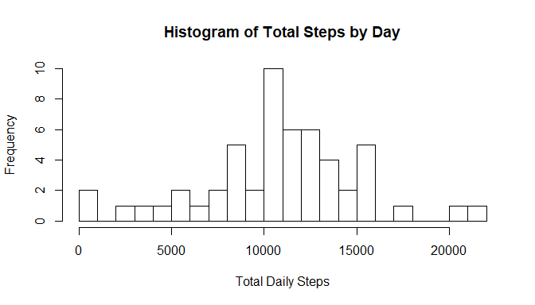
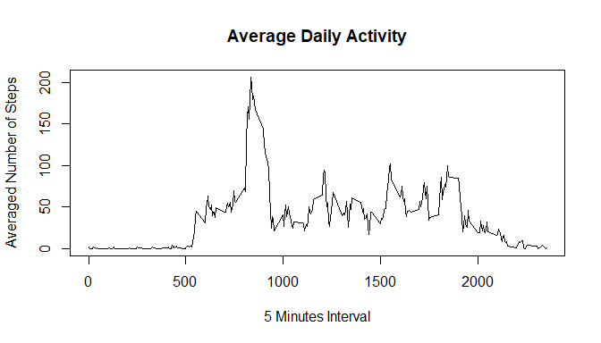
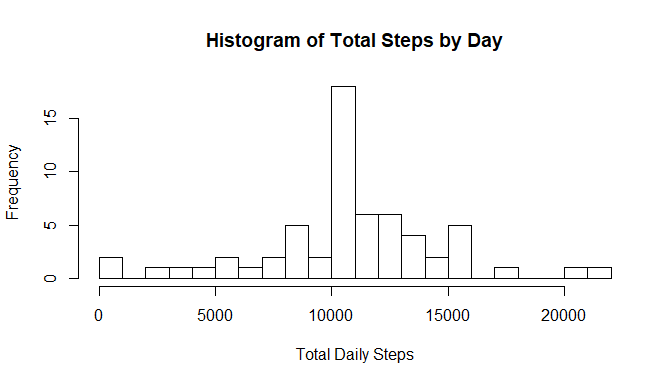
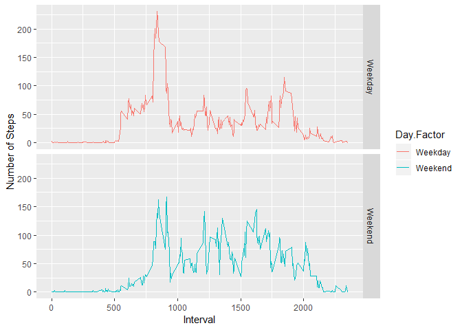

## Loading and preprocessing the data

Data was downloaded and unzip before loading


```r
activity<-read.csv("activity.csv")
activity$date<-as.Date(activity$date,format("%Y-%m-%d"))
```
## What is mean total number of steps taken per day?


```r
sumday<-aggregate(activity$steps,by=list(activity$date),FUN=sum)
```


```r
hist(sumday$x,breaks = 20,xlab = "Total Daily Steps", main = "Histogram of Total Steps by Day")
```

<!-- -->


```r
mean<-mean(sumday$x,na.rm = T)
median<-median(sumday$x,na.rm=T)
```

The mean and median of total number of steps taken per day are 1.0766189\times 10^{4} and 10765,respectively.


## What is the average daily activity pattern?


```r
clean<-na.omit(activity)
tseries<-aggregate(clean$steps,by=list(clean$interval),FUN=mean)
names(tseries)=c("interval","mean.steps")
```


```r
plot(tseries$interval,tseries$mean.steps,type="l",xlab = "5 Minutes Interval",ylab ="Averaged Number of Steps",main = "Average Daily Activity" )
```

<!-- -->


```r
max<-tseries$interval[tseries$mean.steps==max(tseries$mean.steps)]
```

 835 interval, on average across all the days in the dataset, contains the maximum number of steps

## Imputing missing values


```r
missing<-nrow(activity)-nrow(clean)
```

There are 2304 rows with missing values in the dataset. <br/>
To complete the dataset, missing values are replace with mean value of steps of the 5 minute interval.


```r
NewDF<-merge(activity,tseries,by="interval")

for(i in 1:nrow(NewDF))
{
ifelse(is.na(NewDF$steps[i]),NewDF$steps[i]<-NewDF$mean.steps[i],NewDF$steps
       [i]<-NewDF$steps[i])
}

NewDF$mean.steps<-NULL
```


```r
sumday1<-aggregate(NewDF$steps,by=list(NewDF$date),FUN=sum)
```


```r
hist(sumday1$x,breaks = 20,xlab = "Total Daily Steps", main = "Histogram of Total Steps by Day")
```

<!-- -->


```r
mean1<-mean(sumday1$x,na.rm=T)
median1<-median(sumday1$x,na.rm=T)
```

### Comaparing the results
The new mean and new median of total number of steps taken per day are 1.0766189\times 10^{4} and 1.0766189\times 10^{4},respectively. <br/>
After imputing the result of the new mean and mediam became similar.  The old mean, 1.0766189\times 10^{4} and the new mean 1.0766189\times 10^{4} are equal. The new median 1.0766189\times 10^{4} is greater than the old median10765.


## Are there differences in activity patterns between weekdays and weekends?


```r
NewDF$dayfactor<-c(1:nrow(NewDF))

for(i in 1:nrow(NewDF))
  {
  ifelse(weekdays(NewDF$date[i])=="Saturday"|weekdays(NewDF$date[i])=="Sunday",NewDF$dayfactor[i]<-"Weekend",NewDF$dayfactor[i]<-"Weekday")       
  }

NewDF$dayfactor<-as.factor(NewDF$dayfactor)
```


```r
tseries1<-aggregate(NewDF$steps, by=list(NewDF$dayfactor,NewDF$interval),FUN=mean)
names(tseries1)<-c("Day.Factor","Interval","Mean.Steps")
```


```r
library(ggplot2)
```

```
## Warning: package 'ggplot2' was built under R version 3.5.3
```

```r
ggplot(tseries1,aes(y=Mean.Steps,x=Interval,color=Day.Factor))+geom_line()+facet_grid(Day.Factor~.)+labs(y="Number of Steps")
```

<!-- -->

The pattern for weekend and weekdays are different. The number of steps increase earlier in weekday compared to weekend which might suggest that on weekdays they start their day earlier.
